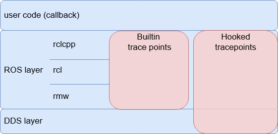

# Tracepoints definition

This section lists all tracepoints and their definitions.

## Tracepoints category

CARET is implemented as an extension of ros2_tracing.
CARET uses tracing mechanism of user-space tracing served by LTTng.
To reduce overhead at runtime, trace points are divided into two types of tracepoints; initialization tracepoints and runtime tracepoints.

Some tracepoints are used for collecting meta-information of executors, nodes, callbacks, and topics during application's initialization.
They are called initialization tracepoints.
The other tracepoints are embedded for sampling timestamps after completion of initialization, and called runtime tracepoints.

By binding these trace data together, CARET can provide when and which callbacks were executed.

See also

- [Initialization tracepoints](./initialization_trace_points.md)
- [Runtime tracepoints](./runtime_trace_points.md)
- [Agnocast initialization tracepoints](./agnocast_initialization_tracepoints.md)
- [Agnocast runtime tracepoints](./agnocast_runtime_tracepoints.md)

## Implementation method category

Each tracepoint for CARET is added by one of following methods.

- Built-in tracepoints
  - tracepoints embedded in original ROS 2 middleware which are utilized by ros2-tracing
  - some of tracepoints, for service, action and lifecycle node, are not utilized by current CARET
- Hooked tracepoints
  - CARET-dedicated tracepoints introduced by function hooking with LD_PRELOAD

CARET utilizes some of the tracepoints built-in original ROS 2.
Some of the tracepoints are added by hooking with LD_PRELOAD.
In addition to the above, Agnocast defines its own tracepoints. Agnocast initialization tracepoints (e.g. `ros2_caret:agnocast_init`) are hooked tracepoints, while Agnocast runtime tracepoints (e.g. `agnocast:agnocast_publish`) are built into the Agnocast library itself.

<prettier-ignore-start>
!!! info
    If you are interested in how CARET-specific tracepoints are extended by LD_PRELOAD, please read this section. In Jazzy, tracepoints are handled exclusively through function hooking using LD_PRELOAD. In Humble, on the other hand, in addition to LD_PRELOAD, the necessary tracepoints are added to a fork of rclcpp. This difference in approach arises because while LD_PRELOAD is suitable for hooking functions defined in dynamic libraries, it cannot be applied to functions implemented using C++ templates.
<prettier-ignore-end>
